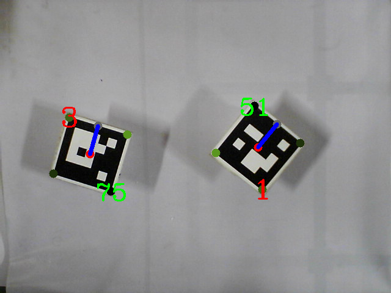
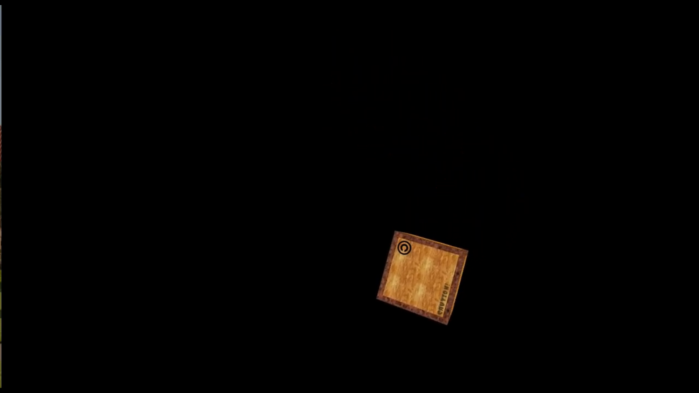

The Projects I have worked on

## Autonomous Warehouse Robot 

For my final year project, I am working on building a warehouse robot that can autonomously move things within a warehouse from one point to other by use of affordable sensors and simple algorithms

Video can be found [Part1](https://www.youtube.com/watch?v=I7Rh3mHooCE), [Part2](https://www.youtube.com/watch?v=zb66srnUcag) 

----

## Self Driving Car: Project DLIVE IIT Delhi

As part of DLIVE team at IIT Delhi building a self driving car from mahindra e2o I Worked on mapping, localization and control along with overall planning of building self driving car with a Mahindra e2o at IIT Delhi

----

## Turtlebot Simulation in gazebo

Wrote a ros node to control the movement of turtlebot so as to reach from current starting point to the other end of maze using LaserScan data moving turtlebot in the direction of farthest obstacle in the world.

Video can be found [here](https://www.youtube.com/watch?v=aV1GmPjS0P4)
[github](https://github.com/khansaadbinhasan/TurtleMover)

----

## Stock Prediction Using Twitter

	

		
		
As part of my minor project, built a stock prediction model. The model correlated the stock market and sentiment from twitter data.

	

----

## Aruco Marker Detection using OpenCV

As part of a competition, I made an aruco marker detection system, the purpose of this was to give values of angles to aruco markers from the horizontal

These are the results:

---

## Autonomous Underwater Vehicle

Built A Localisation System for an Autonomous Underwater Vehicle for participating in Singapore AUV Challenge.

## Other Projects

I regularly follow youtube tutorials to build interesting projects:
> Bipedal Robot From Open AI Gym using DDPG Algorithm

Video can be found [here](https://www.youtube.com/watch?v=CqSfSTgtQ9U)

> Moving Cube with openGL

Video can be found [here](https://www.youtube.com/watch?v=0-QsvuVvP-4)

<!--  -->
